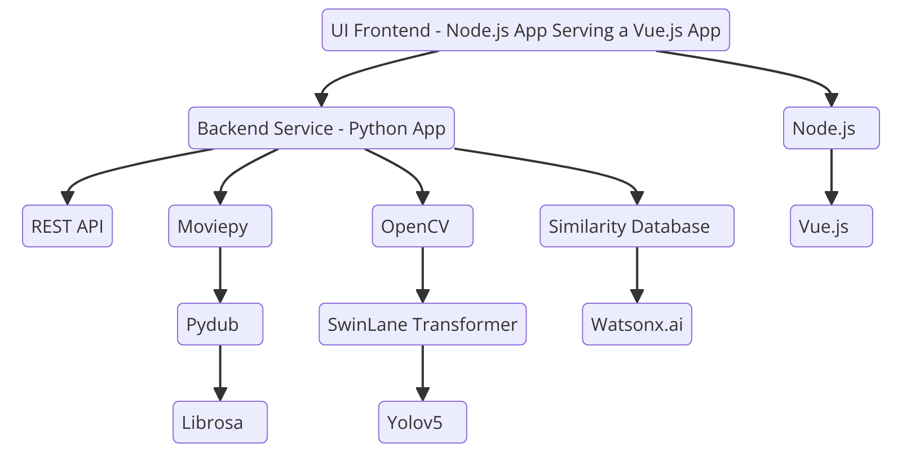
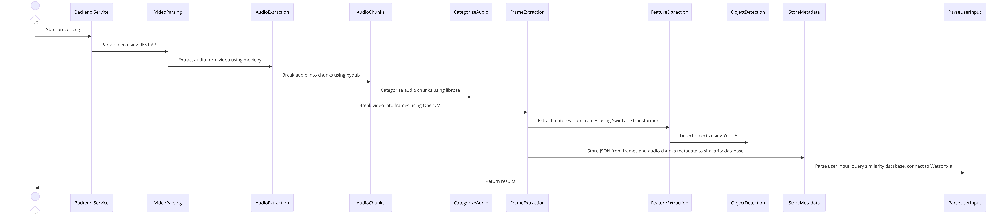

### Stack

* Backend
  * Python 3.11
  * Poetry dependency manager
  * OpenCV for Frame extraction
  * SwinLane transformer for Frame feature extraction
  * Yolov5 for Frame object detection
  * MoviePy for Audio extraction
  * PyDub for Audio split
  * Librosa for Audio chunk classification
  
* Frontend
  * Node.js server
  * Vue.js v3 

### Diagrams

#### Stack

#### Pipelines flow

### Backend instructions

For specific instructions on how to install the dependencies and run the backend service, refer to the documentation linked below:

- [Backend documentation](./service/README.md)

### Frontend instructions

For specific instructions on how to install the dependencies, build the UI bundle, and execute it, refer to the documentation linked below:
- [Frontend documentation](./ui/README.md)
